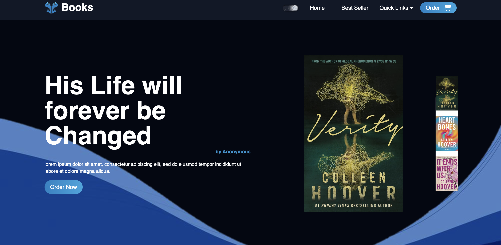
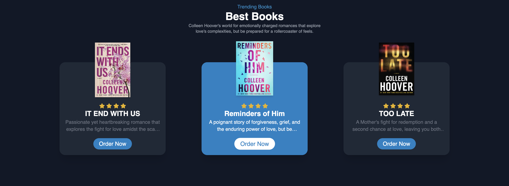

# Colleen Hoover Book Store 📚

Welcome to the Colleen Hoover Book Store! Explore a world of captivating novels by Colleen Hoover, featuring heartwarming romances and gripping tales.

## Features ✨

- Built with React and Tailwind CSS
- Responsive design for optimal viewing on all devices
- Dark mode feature for a comfortable reading experience
- Beautiful landing page design

## Getting Started 🚀

1. Clone the repository: `https://github.com/Abhinendra2016/Book-Store-Using-React-JS.git`
2. Install dependencies: `npm install`
3. Start the development server: `npm start`

## Usage 📖

- Browse through our collection of Colleen Hoover books
- Toggle dark mode for a comfortable reading experience
- Click on a book to view details and purchase options

## Preview 📸

## Contributing 🤝

1. Fork the repository
2. Create a new branch: `git checkout -b feature/new-feature`
3. Make your changes
4. Commit your changes: `git commit -am 'Add new feature'`
5. Push to the branch: `git push origin feature/new-feature`
6. Submit a pull request

## License 📝

This project is licensed under the MIT License - see the [LICENSE](LICENSE) file for details.
